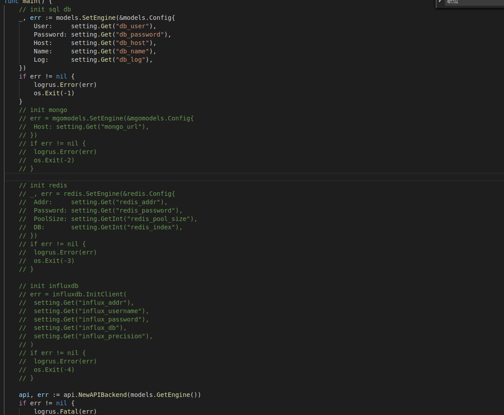
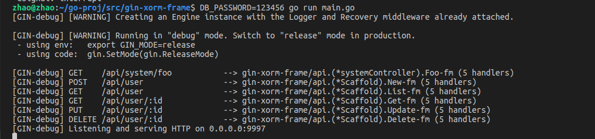
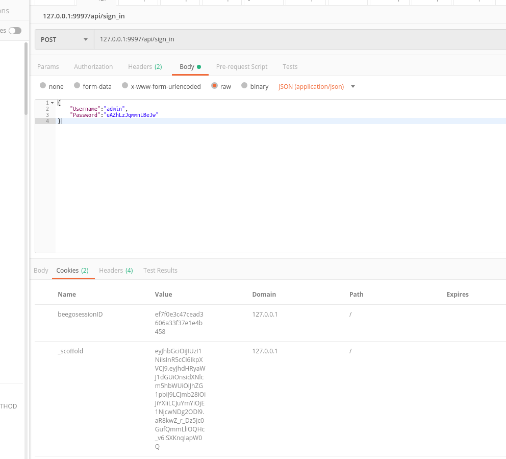
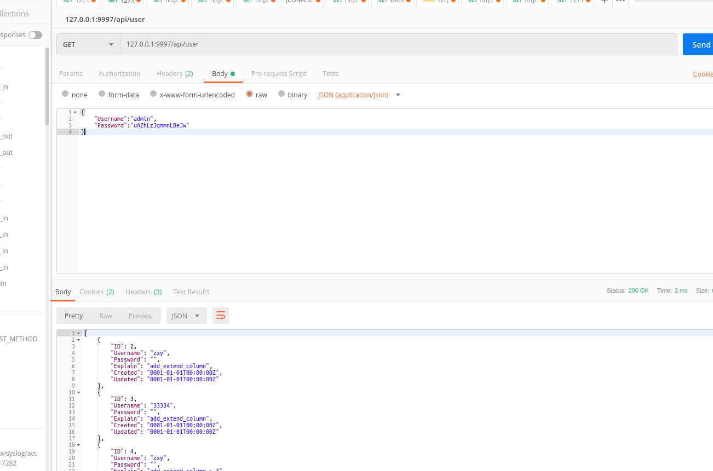

## golang web开发脚手架,集成了redis,mongo,influxdb数据库相关api

### 介绍
1. 采用　gin + xorm 自动生成增删改查api，可重写增删改查api函数　
2. golang的orm库中xorm是本人觉得比较好用的，语法都很清晰(本人最开始用beego/orm和gorm现在转xorm了)，文档地址 http://www.xorm.io/
3. 程序启动的默认配置都在setting包下面，setting优先从环境变量里面读取配置
4. docker-compose文件夹下面有常用的一些组件的docker-compose.yml以及相关配置，可以直接使用，或者自行更改配置
5. main函数中注释的部分需要根据本地数据库情况来链接，暂时只放开了mysql链接 (配置从setting包里面看默认配置，稍微更改即可链接成功)


## 使用
1. 切换的此目录
2. go run main.go  #如果启动顺利可以看到下面打印，如果失败请检查数据库链接配置，在setting包下面

3. 如果需要链接其他数据库，在main.go里面把相关db链接代码注释放开即可
4. 在api文件夹下面加入controllers代码 
5. 在models文件下面加入models文件
6. 相关的工具类和方法在utils包下面添加
7. 程序启动后在未登录情况下，调用接口一律报401。【sign_in(POST请求)，sign_out(POST请求),user_info(Get请求)】除外
8. 启动后初始化账号密码写入当前目录 `default_pass` 文件中,如果想增加管理员账号，在接口中调用models.Admin下面的api
9. 需要先调用 `xxxxx/api/sign_in` 进行登录,参数如下:
```
{
	"Username":"admin",
	"Password":"ladfjianfalen"
}
```
登录成功之后可以看到cookie已经写入客户端(我用的是postman)

登录之后可以调用其他接口了

10. jwt过期时间在utils.cookie文件里设置 
